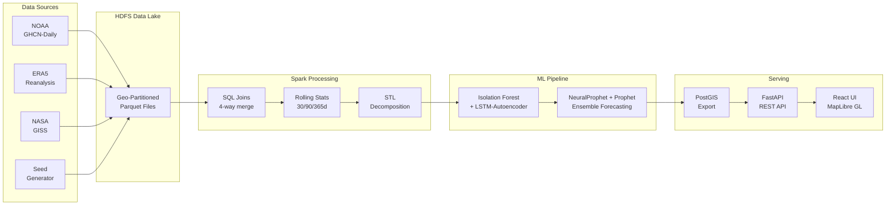

# Global Climate Anomaly Detection & Forecasting Engine

A full-stack distributed platform for detecting anomalous climate events — heatwaves, cold snaps, precipitation extremes — across 100+ years of global weather station data, with ML-powered anomaly detection and time-series forecasting.

**Tech Stack:** PySpark 3.5 · Spark SQL · Window Functions · `applyInPandas` · HDFS · FastAPI · PostGIS · React 18 · MapLibre GL · Recharts · TailwindCSS · Docker Compose

    

---

## Quick Start (Local Development)

The fastest way to get the app running locally — no Spark or HDFS needed.

### Prerequisites

- **Python 3.11+** (tested with 3.11 and 3.13)
- **Node.js 18+**
- **Docker** (only for the PostGIS database container)

### Run

```bash
git clone https://github.com/dhairyamishra/CLIMATE-PREDICTION-SPARK.git
cd CLIMATE-PREDICTION-SPARK
cp .env.example .env
python run_local.py --seed
```

This single command will:

1. Start a PostGIS container on port 5432
2. Create a Python venv and install backend dependencies
3. Install frontend npm dependencies
4. Seed the database with 20 stations + 200 anomalies + monthly summaries
5. Start the FastAPI backend on http://localhost:8000
6. Start the React frontend on http://localhost:5173

Open **http://localhost:5173** — you should see the interactive map with anomaly heatmap dots across the globe.

### Subsequent runs (faster)

```bash
python run_local.py --skip-install          # reuse existing venv + node_modules
python run_local.py --seed --skip-install   # re-seed DB + skip installs
python run_local.py --no-db                 # bring your own PostgreSQL
python run_local.py --build                 # production build + vite preview
```

Press **Ctrl+C** to stop all services gracefully.

### Access

| Service | URL |
|---------|-----|
| Frontend | http://localhost:5173 |
| API Docs (Swagger) | http://localhost:8000/docs |
| Health Check | http://localhost:8000/health |

---

## Full Docker Compose Stack

For the complete distributed pipeline with Spark, HDFS, and the full 5 GB seed dataset.

### Prerequisites

- **Docker & Docker Compose** v2.0+
- **~10 GB free disk space**

### 1. Start Infrastructure

```bash
cp .env.example .env
docker-compose up -d
```

This starts **10 services**: HDFS NameNode + 2 DataNodes, Spark Master + 2 Workers, PostGIS, FastAPI backend, React frontend, and Nginx.

### 2. Run the Full Pipeline

**Linux / macOS:**
```bash
docker-compose exec spark-master bash /opt/scripts/run_pipeline.sh
```

**Windows:**
```cmd
scripts\run_pipeline.bat
```

The pipeline runs 7 steps:
1. Generate ~5 GB seed data (500 stations, 50 years)
2. Upload seed data to HDFS
3. Ingest raw data into Parquet (GHCN, ERA5, GISS)
4. Join datasets + compute rolling statistics
5. Run STL decomposition
6. Anomaly detection (Isolation Forest + LSTM-Autoencoder) + forecasting (NeuralProphet + Prophet + statistical)
7. Export results to PostGIS

**Expected duration:** 15-45 minutes depending on hardware.

### 3. Access

| Service | URL | Description |
|---------|-----|-------------|
| Frontend | http://localhost:5173 | React + MapLibre GL interactive map |
| API Docs | http://localhost:8000/docs | Swagger/OpenAPI auto-docs |
| Spark UI | http://localhost:8080 | Spark job monitoring |
| HDFS UI | http://localhost:9870 | HDFS file browser |
| Nginx | http://localhost:80 | Reverse proxy (production entry) |

---

## Architecture


### Data Flow



---

## Datasets

| Dataset | Source | Description | Size (Full) |
|---------|--------|-------------|-------------|
| NOAA GHCN-Daily | [NOAA](https://www.ncei.noaa.gov/products/land-based-station/global-historical-climatology-network-daily) | 2.5B+ daily observations from 100K+ stations | ~80 GB |
| ERA5 Reanalysis | [Copernicus/ECMWF](https://cds.climate.copernicus.eu/) | Gridded global climate reanalysis (2m temp, precip, wind) | ~500 GB subset |
| NASA GISS | [NASA](https://data.giss.nasa.gov/gistemp/) | Monthly surface temperature anomaly grids (GISTEMP v4) | ~2 GB |

> **Demo mode:** A **~5 GB synthetic seed dataset** (500 stations across 15 climate regions, 1970-2020, with 16 embedded real-world extreme events) is generated for the Docker pipeline. For local development, a lightweight seed (20 stations, 200 anomalies) is available via `run_local.py --seed`.

### Seed Data Details

- **500 stations** across US, Canada, Mexico, Brazil, Argentina, UK, Germany, France, Russia, China, India, Japan, Australia, South Africa, Kenya
- **~9.1M daily observations** (50 years x 365 days x 500 stations)
- **ERA5-like gridded data** — 2m temperature, total precipitation, 10m wind, surface pressure at 2.5 degree resolution
- **GISS-like monthly anomalies** — 5 x 5 degree grid cells with temperature anomaly trends
- **16 embedded extreme events** — 2003 European heatwave, 2010 Russian heat, 2014 Polar Vortex, Hurricane Katrina, 2019 Australian bushfires, and more

---

## Spark Mastery Demonstrated

| Technique | File | Description |
|-----------|------|-------------|
| **Spark SQL Joins** | `join_datasets.py` | 4-way join: station metadata, daily obs, ERA5 grid, GISS anomalies with geohash spatial matching |
| **Custom Partitioning** | All ingestion scripts | Hive-style geo-partitioned Parquet by `geohash_prefix` + `year`/`month` for spatial-temporal queries |
| **Window Functions** | `rolling_statistics.py` | 30/90/365-day rolling mean, stddev, min, max, z-scores via `Window.partitionBy().orderBy().rangeBetween()` |
| **Distributed STL** | `stl_decomposition.py` | Seasonal-Trend decomposition per station via `applyInPandas` on grouped DataFrame |
| **Hybrid Anomaly Detection** | `anomaly_detection.py` | Multi-variate anomaly detection (temp z-scores, precip z-scores, STL residuals) per station via `applyInPandas` using Isolation Forest + LSTM-Autoencoder |
| **Distributed Forecasting** | `forecasting.py` | NeuralProphet, Prophet, and statistical baseline per station parallelized via `applyInPandas`, with weighted ensemble combination |
| **Adaptive Execution** | `spark_config.py` | AQE enabled with coalescing, dynamic partition overwrite, Kryo serialization |
| **HDFS Data Lake** | Docker HDFS cluster | Real NameNode + 2 DataNodes, replication factor 2, Snappy-compressed Parquet |

---

## API Endpoints

| Method | Endpoint | Description |
|--------|----------|-------------|
| `GET` | `/api/anomalies` | Query anomalies by bounding box, time range, type, severity |
| `GET` | `/api/stations` | List/search stations with geographic filtering |
| `GET` | `/api/stations/{id}` | Station detail with metadata + recent anomalies |
| `GET` | `/api/stations/{id}/forecast` | Temperature and precipitation forecasts with confidence intervals |
| `GET` | `/api/timeseries/{station_id}` | Historical observations at daily/monthly/yearly resolution |
| `GET` | `/api/tiles` | Pre-aggregated anomaly tiles for heatmap rendering |
| `GET` | `/api/summary` | Global dashboard statistics, monthly trends, top regions |
| `GET` | `/health` | Health check with DB connectivity, pool stats, cache info |

All endpoints support pagination (`limit`, `offset`) and return JSON. Anomaly and tile endpoints support spatial filtering (`min_lat`, `max_lat`, `min_lon`, `max_lon`).

---

## Frontend Features

- **Global anomaly heatmap** — MapLibre GL heatmap + circle layers over dark CARTO basemap, color-coded by anomaly type and severity
- **Time slider** — Dual-handle range slider for historical exploration (1970-2025) with decade markers
- **Anomaly type filters** — Toggle heatwave / cold snap / precipitation extreme with icon pills
- **Severity threshold** — Continuous slider to filter by minimum anomaly severity
- **Station drill-down** — Click any station for a detailed sidebar with:
  - Time-series charts (T-Max, T-Min, 30d rolling avg, precipitation) via Recharts
  - Forecast charts with upper/lower confidence interval bands
  - Anomaly timeline with severity badges, type, duration, and deviation stats
  - Resolution toggle (daily, monthly, yearly)
- **Dashboard panel** — Global statistics with summary cards, pie chart, stacked bar chart, and top regions
- **Dark theme** — Custom CSS variables, dark CARTO basemap, styled MapLibre popups and controls
- **Resilient map loading** — Inline GeoJSON sources with fallback timer; map renders data even if tile CDN is slow
- **Error boundary** — Graceful crash recovery with "Try Again" screen
- **Toast notifications** — Auto-dismissing alerts for errors, warnings, and success events
- **Skeleton loading states** — Shimmer placeholders while data loads
- **Accessibility** — ARIA labels, keyboard focus rings, screen-reader-friendly controls

---

## Production Improvements

### Backend Performance

| Improvement | Details |
|---|---|
| **GZip compression** | All responses >500 bytes compressed (~60-80% smaller JSON) |
| **Cache-Control headers** | Per-endpoint HTTP caching: `/stations` 300s, `/summary` 60s, `/anomalies` 30s |
| **Structured request logging** | Method, path, status, latency (ms), request ID on every request |
| **In-memory TTL cache** | `/summary` endpoint cached for 60s to avoid redundant aggregate queries |
| **DB connection pool tuning** | `pool_recycle=1800`, `pool_pre_ping=True`, statement/lock timeouts |
| **20+ database indexes** | GIST spatial indexes, composite indexes for time-series and anomaly queries |
| **Enhanced health endpoint** | Version, uptime, DB latency, pool stats, cache entry count |

### Frontend UI

| Improvement | Details |
|---|---|
| **Error boundary** | React error boundary with crash recovery UI |
| **Toast notifications** | 4 types, auto-dismiss, max 5 visible, slide-in animation |
| **API retry with backoff** | 3 attempts with [0ms, 1000ms, 3000ms] delays for 5xx/429 |
| **Skeleton loading states** | Shimmer placeholders for map, station panel, dashboard |
| **Responsive sidebar** | Slide-in panel, 85vw mobile / 400px desktop, overlay backdrop |
| **ARIA accessibility** | Role attributes, aria-pressed, aria-label, aria-live, focus rings |
| **Vite build optimization** | 4 manual chunks for parallel loading and long-term caching |

---

## Testing

### Backend Tests

```bash
cd backend
pip install -r requirements-test.txt
python -m pytest tests/ -v
```

### Spark Tests (requires Java/JVM)

```bash
python -m pytest spark/tests/test_seed_data.py -v
```

### Frontend Dev Server

```bash
cd frontend
npm install
npm run dev
```

---

## Project Structure

```
CLIMATE-PREDICTION-SPARK/
|
|-- run_local.py                           # Local dev runner (DB + backend + frontend)
|-- docker-compose.yml                     # 10-service Docker orchestration
|-- .env.example                           # Environment template
|
|-- spark/                                 # PySpark processing
|   |-- config/
|   |   +-- spark_config.py                #   SparkSession config, HDFS paths
|   |-- ingestion/
|   |   |-- ghcn_daily.py                  #   NOAA GHCN-Daily station + observation ingestion
|   |   |-- era5_reanalysis.py             #   ERA5 reanalysis ingestion
|   |   +-- giss_temperature.py            #   NASA GISS surface temp ingestion
|   |-- processing/
|   |   |-- join_datasets.py               #   4-way SQL join
|   |   |-- rolling_statistics.py          #   30/90/365-day rolling stats
|   |   |-- stl_decomposition.py           #   Distributed STL decomposition
|   |   +-- export_to_postgis.py           #   Spark -> PostGIS bulk export
|   |-- ml/
|   |   |-- anomaly_detection.py           #   Isolation Forest + classification
|   |   +-- forecasting.py                 #   Prophet + statistical + ensemble
|   +-- tests/
|       |-- test_seed_data.py
|       |-- test_rolling_statistics.py
|       +-- test_anomaly_detection.py
|
|-- backend/                               # FastAPI application
|   |-- Dockerfile
|   |-- requirements.txt                   #   20 Python dependencies (>= pins)
|   |-- app/
|   |   |-- main.py                        #   FastAPI app, middleware, health check
|   |   |-- core/
|   |   |   |-- config.py                  #   Pydantic Settings
|   |   |   |-- database.py               #   Async SQLAlchemy engine + pool
|   |   |   +-- cache.py                  #   In-memory TTL cache
|   |   |-- api/
|   |   |   |-- anomalies.py              #   GET /anomalies
|   |   |   |-- stations.py               #   GET /stations, GET /stations/{id}
|   |   |   |-- forecasts.py              #   GET /stations/{id}/forecast
|   |   |   |-- timeseries.py             #   GET /timeseries/{id}
|   |   |   |-- tiles.py                  #   GET /tiles
|   |   |   +-- summary.py               #   GET /summary
|   |   +-- models/
|   |       |-- orm.py                    #   SQLAlchemy ORM (7 tables)
|   |       +-- schemas.py               #   Pydantic schemas
|   +-- tests/
|
|-- frontend/                              # React application
|   |-- Dockerfile
|   |-- package.json                       #   React 18 + MapLibre GL + Recharts + Tailwind
|   |-- vite.config.js                     #   API proxy, chunk splitting
|   +-- src/
|       |-- main.jsx                       #   React root + ErrorBoundary + ToastProvider
|       |-- App.jsx                        #   App shell: map + sidebar + filters + time slider
|       |-- components/
|       |   |-- AnomalyMap.jsx             #   MapLibre GL map with inline sources/layers
|       |   |-- TimeSlider.jsx             #   Dual-range year slider
|       |   |-- FilterBar.jsx              #   Anomaly type + severity filters
|       |   |-- StationPanel.jsx           #   Station drill-down with charts
|       |   |-- DashboardSummary.jsx       #   Global stats dashboard
|       |   |-- Header.jsx
|       |   |-- Sidebar.jsx
|       |   |-- ErrorBoundary.jsx
|       |   |-- Toast.jsx
|       |   +-- Skeleton.jsx
|       |-- hooks/
|       |   +-- useApi.js                  #   useApi + useDebounce hooks
|       |-- services/
|       |   +-- api.js                     #   API client with retry + backoff
|       +-- utils/
|           +-- cn.js                      #   clsx + tailwind-merge
|
|-- docker/                                # Infrastructure configs
|   |-- hdfs/
|   |   |-- Dockerfile                     #   Hadoop 3.3.6
|   |   |-- core-site.xml
|   |   +-- hdfs-site.xml
|   |-- spark/
|   |   |-- Dockerfile                     #   Apache Spark 3.5.8 + Python ML deps
|   |   |-- core-site.xml
|   |   +-- hdfs-site.xml
|   |-- postgis/
|   |   +-- init.sql                       #   Schema DDL + 20 performance indexes
|   +-- nginx/
|       +-- nginx.conf
|
|-- scripts/                               # Pipeline orchestration
|   |-- generate_seed_data.py              #   ~5GB synthetic dataset generator
|   |-- upload_to_hdfs.py                  #   Seed data -> HDFS (via PySpark Hadoop FS)
|   |-- seed_local_db.py                   #   Lightweight local DB seeder (20 stations)
|   |-- run_pipeline.sh                    #   Pipeline script (Linux/macOS)
|   +-- run_pipeline.bat                   #   Pipeline script (Windows)
```

---

## Docker Services

| Service | Image | Ports | Purpose |
|---------|-------|-------|---------|
| `namenode` | Hadoop 3.3.6 | 9870, 9000 | HDFS NameNode |
| `datanode1` | Hadoop 3.3.6 | -- | HDFS DataNode |
| `datanode2` | Hadoop 3.3.6 | -- | HDFS DataNode |
| `spark-master` | Apache Spark 3.5.8 | 8080, 7077 | Spark Master |
| `spark-worker-1` | Apache Spark 3.5.8 | -- | Spark Worker (2 cores, 2GB) |
| `spark-worker-2` | Apache Spark 3.5.8 | -- | Spark Worker (2 cores, 2GB) |
| `postgis` | postgis/postgis:16-3.4 | 5432 | PostgreSQL + PostGIS |
| `backend` | Python 3.11 | 8000 | FastAPI REST API |
| `frontend` | Node 20 | 5173 | React dev server |
| `nginx` | nginx:1.25-alpine | 80 | Reverse proxy |

## PostGIS Schema

| Table | Description |
|-------|-------------|
| `stations` | Station metadata with PostGIS Point geometry |
| `observations` | Daily observations with rolling stats |
| `anomalies` | Detected anomalies with type, severity, geometry |
| `forecasts` | Per-station forecasts with confidence intervals |
| `anomaly_tiles` | Pre-aggregated tiles by geohash + month |
| `monthly_summary` | Monthly anomaly counts and avg severity |
| `model_registry` | ML model versions and performance metrics |

---

## Anomaly Detection Approach

1. **Feature Engineering** — Rolling z-scores (30d window), climatological deviation (day-of-year baseline), STL residuals
2. **Hybrid Ensembling** — Trained per station on multi-variate features:
    - **Isolation Forest** (contamination = 2%)
    - **LSTM-Autoencoder** (reconstruction error sequences via Keras)
3. **Classification** — Auto-classified as `heatwave` / `cold_snap` / `precip_extreme` based on z-score direction and magnitude
4. **Duration tracking** — Consecutive anomaly days grouped into events with deviation metrics
5. **Tile aggregation** — Pre-aggregated by geohash prefix + year/month for fast heatmap rendering
6. **Embedded extreme events** — 16 known climate events reproduced in seed data

## Forecasting Approach

1. **Multivariate & Univariate ML Architecture** — 
    - **NeuralProphet** for multivariate context using AR-Net with lagged regressors
    - **Prophet** for univariate predictions with yearly seasonality
    - Run per station per variable via `applyInPandas`
2. **Statistical baseline** — Day-of-year climatology + linear trend with empirical confidence intervals
3. **Ensemble** — Weighted 50% NeuralProphet, 30% Prophet, 20% statistical (with 70/30 Prophet/statistical fallback) mixing and merging confidence intervals
4. **Validation** — Hold-out last 52 weeks; MAE and RMSE per station per variable
5. **Model registry** — Results stored with type, version, and performance metrics

---

## Environment Variables

Copy `.env.example` to `.env`. Key variables:

| Variable | Default | Description |
|----------|---------|-------------|
| `POSTGRES_USER` | `climate` | PostGIS username |
| `POSTGRES_PASSWORD` | `climate_secret` | PostGIS password |
| `POSTGRES_DB` | `climate_db` | Database name |
| `POSTGRES_HOST` | `postgis` | DB host (overridden to `localhost` by `run_local.py`) |
| `API_PORT` | `8000` | FastAPI port |
| `API_KEY` | `dev-api-key-change-me` | API key (change for production) |
| `SPARK_DRIVER_MEMORY` | `2g` | Spark driver memory |
| `SPARK_EXECUTOR_MEMORY` | `2g` | Spark executor memory |
| `NOAA_API_TOKEN` | placeholder | Only needed for real NOAA data download |
| `CDS_API_KEY` | placeholder | Only needed for real ERA5 data download |

---

## Data Attribution

- NOAA Global Historical Climatology Network - Daily (GHCN-Daily), NOAA National Centers for Environmental Information
- ERA5 hourly data on single levels from 1940 to present, Copernicus Climate Change Service (C3S)
- GISS Surface Temperature Analysis (GISTEMP v4), NASA Goddard Institute for Space Studies

## License

MIT
