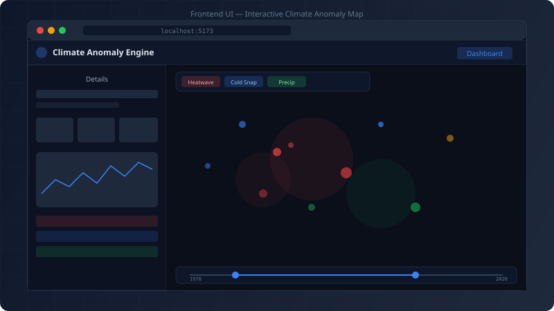
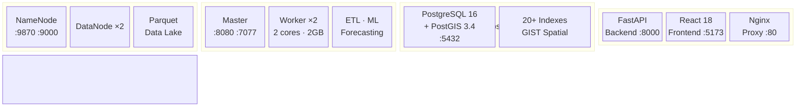
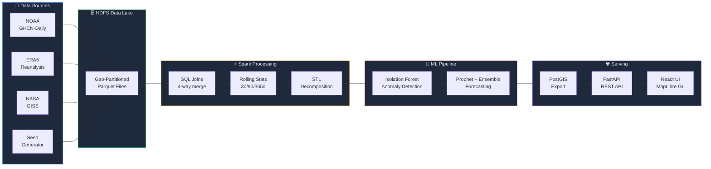
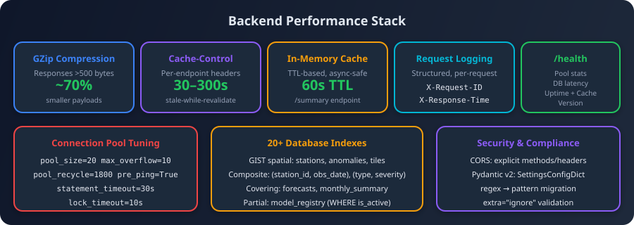
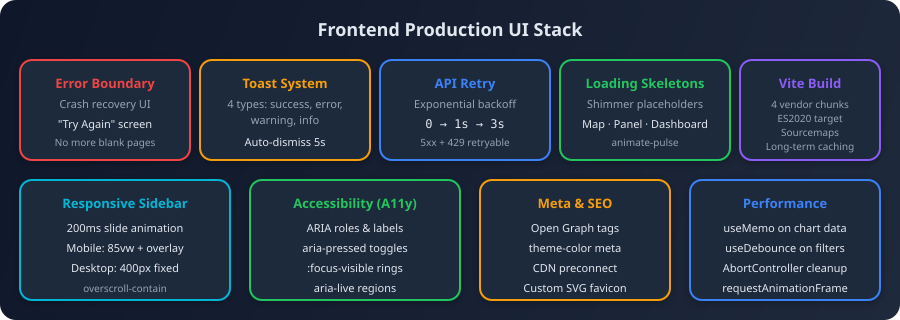
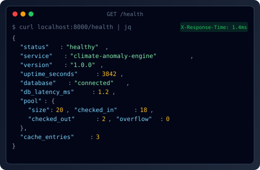
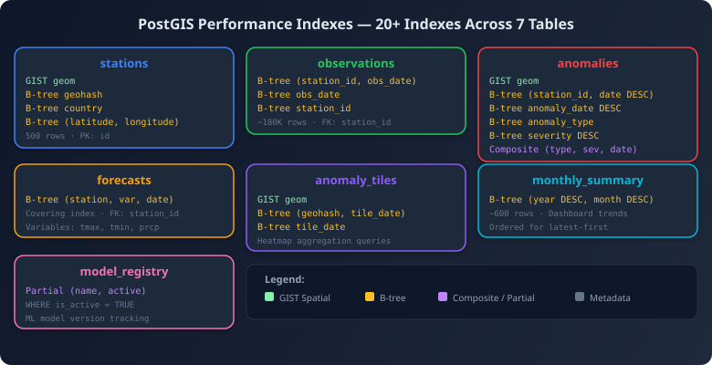

# 🌍 Global Climate Anomaly Detection & Forecasting Engine

A full-stack distributed platform for detecting anomalous climate events — heatwaves, cold snaps, precipitation extremes — across 100+ years of global weather station data, with ML-powered anomaly detection and time-series forecasting.

**Tech Stack:** PySpark 3.5 · Spark SQL · Window Functions · `applyInPandas` · HDFS · FastAPI · PostGIS · React 18 · MapLibre GL · Recharts · TailwindCSS · Docker Compose

      

<p align="center">
  
</p>

---

## Implementation Status

| Phase | Description | Status | Files |
|-------|-------------|--------|-------|
| **1. Scaffolding** | Repo structure, Docker Compose, Dockerfiles, env config | ✅ Complete | 14 |
| **2. Data Ingestion** | GHCN-Daily, ERA5, GISS ingestion scripts + ~5GB seed generator | ✅ Complete | 5 |
| **3. Spark Processing** | SQL joins, 30/90/365-day rolling stats, STL decomposition | ✅ Complete | 4 |
| **4. Anomaly Detection** | Isolation Forest, anomaly classification, tile aggregation | ✅ Complete | 1 |
| **5. Forecasting** | Prophet, statistical baseline, ensemble, per-station parallelism | ✅ Complete | 1 |
| **6. Backend API** | FastAPI + PostGIS schema, 7 API endpoints, ORM, Pydantic schemas | ✅ Complete | 19 |
| **7. Frontend** | React + MapLibre GL heatmap, Recharts charts, dark theme UI | ✅ Complete | 24 |
| **8. Pipeline & Deploy** | Spark→PostGIS export, pipeline scripts (Linux + Windows), README | ✅ Complete | 4 |
| **9. Testing** | Spark unit tests, backend API tests, fixtures, test config | ✅ Complete | 17 |
| **10. Production Hardening** | GZip, caching, DB indexes, error boundary, skeletons, accessibility | ✅ Complete | — |

**Total: 90 files across the full stack.**

---

## Architecture



### Data Flow



---

## Datasets

| Dataset | Source | Description | Size (Full) |
|---------|--------|-------------|-------------|
| NOAA GHCN-Daily | [NOAA](https://www.ncei.noaa.gov/products/land-based-station/global-historical-climatology-network-daily) | 2.5B+ daily observations from 100K+ stations | ~80 GB |
| ERA5 Reanalysis | [Copernicus/ECMWF](https://cds.climate.copernicus.eu/) | Gridded global climate reanalysis (2m temp, precip, wind) | ~500 GB subset |
| NASA GISS | [NASA](https://data.giss.nasa.gov/gistemp/) | Monthly surface temperature anomaly grids (GISTEMP v4) | ~2 GB |

> **Demo mode:** A **~5 GB synthetic seed dataset** (500 stations across 15 climate regions, 1970–2020, with 16 embedded real-world extreme events) is generated for end-to-end testing without downloading the full datasets.

### Seed Data Details

- **500 stations** across US, Canada, Mexico, Brazil, Argentina, UK, Germany, France, Russia, China, India, Japan, Australia, South Africa, Kenya
- **~9.1M daily observations** (50 years × 365 days × 500 stations)
- **ERA5-like gridded data** — 2m temperature, total precipitation, 10m wind, surface pressure at 2.5° resolution
- **GISS-like monthly anomalies** — 5° × 5° grid cells with temperature anomaly trends
- **16 embedded extreme events** — 2003 European heatwave, 2010 Russian heat, 2014 Polar Vortex, Hurricane Katrina, 2019 Australian bushfires, and more

---

## Spark Mastery Demonstrated

| Technique | File | Description |
|-----------|------|-------------|
| **Spark SQL Joins** | `join_datasets.py` | 4-way join: station metadata ⋈ daily obs ⋈ ERA5 grid ⋈ GISS anomalies, with geohash spatial matching |
| **Custom Partitioning** | All ingestion scripts | Hive-style geo-partitioned Parquet by `geohash_prefix` + `year`/`month` for spatial-temporal queries |
| **Window Functions** | `rolling_statistics.py` | 30/90/365-day rolling mean, stddev, min, max, z-scores via `Window.partitionBy().orderBy().rangeBetween()` |
| **Distributed STL** | `stl_decomposition.py` | Seasonal-Trend decomposition per station via `applyInPandas` on grouped DataFrame |
| **Isolation Forest** | `anomaly_detection.py` | Multi-variate anomaly detection (temp z-scores, precip z-scores, STL residuals) per station via `applyInPandas` |
| **Distributed Forecasting** | `forecasting.py` | Prophet + statistical baseline per station parallelized via `applyInPandas`, with ensemble combination |
| **Adaptive Execution** | `spark_config.py` | AQE enabled with coalescing, dynamic partition overwrite, Kryo serialization |
| **HDFS Data Lake** | Docker HDFS cluster | Real NameNode + 2 DataNodes, replication factor 2, Snappy-compressed Parquet |

---

## Quick Start

### Prerequisites

- **Docker & Docker Compose** (v2.0+)
- **~10 GB free disk space** (seed data + Docker images)

### 1. Clone & Configure

```bash
git clone https://github.com/yourusername/CLIMATE-PREDICTION-SPARK.git
cd CLIMATE-PREDICTION-SPARK
cp .env.example .env
```

### 2. Start Infrastructure

```bash
docker-compose up -d
```

This starts **10 services**: HDFS NameNode, 2 DataNodes, Spark Master, 2 Spark Workers, PostGIS, FastAPI backend, React frontend, and Nginx.

### 3. Run the Full Pipeline

**Linux / macOS:**
```bash
docker-compose exec spark-master bash /opt/scripts/run_pipeline.sh
```

**Windows:**
```cmd
scripts\run_pipeline.bat
```

The pipeline runs 7 steps:
1. Generate ~5 GB seed data (500 stations, 50 years)
2. Upload seed data to HDFS
3. Ingest raw data → Parquet (GHCN, ERA5, GISS)
4. Join datasets + compute rolling statistics
5. Run STL decomposition
6. Anomaly detection (Isolation Forest) + forecasting (Prophet + statistical)
7. Export results to PostGIS

### 4. Access the Application

| Service | URL | Description |
|---------|-----|-------------|
| **Frontend** | http://localhost:5173 | React + MapLibre GL interactive map |
| **API Docs** | http://localhost:8000/docs | Swagger/OpenAPI auto-docs |
| **Spark UI** | http://localhost:8080 | Spark job monitoring |
| **HDFS UI** | http://localhost:9870 | HDFS file browser |
| **Nginx** | http://localhost:80 | Reverse proxy (production entry) |

---

## API Endpoints

| Method | Endpoint | Description |
|--------|----------|-------------|
| `GET` | `/api/anomalies` | Query anomalies by bounding box, time range, type, severity |
| `GET` | `/api/stations` | List/search stations with geographic filtering |
| `GET` | `/api/stations/{id}` | Station detail with metadata + recent anomalies |
| `GET` | `/api/stations/{id}/forecast` | Temperature & precipitation forecasts with confidence intervals |
| `GET` | `/api/timeseries/{station_id}` | Historical observations at daily/monthly/yearly resolution |
| `GET` | `/api/tiles` | Pre-aggregated anomaly tiles for heatmap rendering |
| `GET` | `/api/summary` | Global dashboard statistics, monthly trends, top regions |
| `GET` | `/health` | Health check |

All endpoints support pagination (`limit`, `offset`) and return JSON. Anomaly and tile endpoints support spatial filtering (`min_lat`, `max_lat`, `min_lon`, `max_lon`).

---

## Frontend Features

- **Global anomaly heatmap** — MapLibre GL heatmap + circle layers over dark CARTO basemap, color-coded by anomaly type and severity
- **Time slider** — Dual-handle range slider for historical exploration (1970–2020) with decade markers
- **Anomaly type filters** — Toggle heatwave / cold snap / precipitation extreme with icon pills
- **Severity threshold** — Continuous slider to filter by minimum anomaly severity
- **Station drill-down** — Click any station for a detailed sidebar with:
  - **Time-series charts** — Temperature (T-Max, T-Min, 30d rolling avg) and precipitation via Recharts `LineChart` + `AreaChart`
  - **Forecast charts** — Predicted values with upper/lower confidence interval bands
  - **Anomaly timeline** — Severity badges with type, duration, and deviation stats
  - **Resolution toggle** — Switch between daily, monthly, yearly aggregation
- **Dashboard panel** — Global statistics with:
  - Summary cards (total stations, anomaly counts by type, avg severity)
  - Pie chart of anomaly distribution
  - Stacked bar chart of monthly anomaly trend
  - Top anomalous regions ranked list with progress bars
- **Dark theme** — Custom CSS variables, dark CARTO basemap, styled MapLibre popups and controls
- **Responsive sidebar** — Slide-in panel (85vw mobile / 400px desktop) with touch overlay and tab navigation
- **Error boundary** — Graceful crash recovery with a "Try Again" screen instead of a white page
- **Toast notifications** — Auto-dismissing alerts for errors, warnings, and success events
- **Skeleton loading states** — Shimmer placeholders for map, station panel, and dashboard while data loads
- **Accessibility** — ARIA labels, `aria-pressed` toggles, keyboard focus rings, `role="toolbar"`, `aria-live` regions

---

## Production Improvements

The following optimizations bring the application from prototype to production-grade. All changes are backward-compatible and verified against the existing test suite (6/6 pass).

### Backend Performance

<p align="center">
  
</p>

| Improvement | File(s) | Details |
|---|---|---|
| **GZip compression** | `backend/app/main.py` | `GZipMiddleware` compresses all responses >500 bytes (~60–80% smaller JSON payloads) |
| **Cache-Control headers** | `backend/app/main.py` | Per-endpoint HTTP caching: `/stations` 300s, `/summary` 60s, `/anomalies` & `/tiles` 30s, with `stale-while-revalidate` |
| **Structured request logging** | `backend/app/main.py` | Every request logged with method, path, status, latency (ms), and request ID. Responses include `X-Request-ID` and `X-Response-Time` headers |
| **In-memory TTL cache** | `backend/app/core/cache.py`, `backend/app/api/summary.py` | Async-safe LRU cache with expiration. The `/summary` endpoint (3 aggregate queries) is cached for 60s, eliminating redundant DB hits |
| **DB connection pool tuning** | `backend/app/core/database.py` | `pool_recycle=1800` (recycle stale connections), `pool_pre_ping=True` (detect broken connections), `statement_timeout=30s`, `lock_timeout=10s` |
| **20+ database indexes** | `docker/postgis/init.sql`, `backend/app/models/orm.py` | GIST spatial indexes on `stations.geom`, `anomalies.geom`, `anomaly_tiles.geom`; composite indexes on `(station_id, obs_date)`, `(anomaly_type, severity, anomaly_date)`, `(station_id, variable, forecast_date)`; covering indexes for dashboard queries |
| **Enhanced `/health` endpoint** | `backend/app/main.py` | Returns version, uptime, DB connectivity + latency (ms), connection pool stats (size, checked_in, checked_out, overflow), cache entry count |
| **CORS tightened** | `backend/app/main.py` | Explicit allowed methods (`GET`, `POST`, `PUT`, `DELETE`, `OPTIONS`) and headers instead of wildcards |
| **Pydantic v2 compliance** | `backend/app/core/config.py`, `backend/app/api/forecasts.py`, `backend/app/api/timeseries.py` | Migrated to `SettingsConfigDict`, `extra="ignore"`, `regex` → `pattern` in Query params |

### Frontend UI & Performance

<p align="center">
  
</p>

| Improvement | File(s) | Details |
|---|---|---|
| **Error boundary** | `frontend/src/components/ErrorBoundary.jsx`, `main.jsx` | Catches unhandled React errors and renders a recovery screen with "Try Again" button instead of a blank page |
| **Toast notifications** | `frontend/src/components/Toast.jsx`, `main.jsx` | Context-based notification system with 4 types (success, error, warning, info), auto-dismiss after 5s, max 5 visible, slide-in animation |
| **API retry with backoff** | `frontend/src/services/api.js` | 3 attempts with delays [0ms, 1000ms, 3000ms] for 5xx and 429 responses. Abort signal support for cancellation |
| **Skeleton loading states** | `frontend/src/components/Skeleton.jsx` | Shimmer placeholders for: map overlay (spinner + text), station panel (stat cards + chart areas), dashboard (cards + chart blocks) |
| **Sidebar slide animation** | `frontend/src/components/Sidebar.jsx` | 200ms CSS `translate-x` transition, mobile overlay backdrop (click to dismiss), responsive width: 85vw (mobile) / 400px (sm+), `overscroll-contain` |
| **Responsive breakpoints** | `Header.jsx`, `Sidebar.jsx`, `FilterBar.jsx` | Dashboard label hidden on `<sm`, info badge hidden on `<md`, sidebar overlays on `<lg` with touch-friendly overlay |
| **ARIA accessibility** | `Header.jsx`, `FilterBar.jsx`, `AnomalyMap.jsx`, `Sidebar.jsx` | `role="banner"`, `role="toolbar"`, `role="complementary"`, `role="application"`, `aria-pressed` on toggles, `aria-label` on all interactive elements, `aria-live="polite"` on severity display |
| **Keyboard focus rings** | `frontend/src/index.css` | Global `:focus-visible` style with `2px solid` ring and `2px` offset using theme `--ring` CSS variable |
| **Meta & SEO tags** | `frontend/index.html` | `<meta name="description">`, `<meta name="theme-color">`, Open Graph tags (`og:title`, `og:description`, `og:type`), CDN `<link rel="preconnect">` for CARTO basemap tiles |
| **Custom favicon** | `frontend/public/favicon.svg` | Climate-themed SVG: dark circle with anomaly trend line and station dot |
| **Vite build optimization** | `frontend/vite.config.js` | 4 manual chunks (`vendor-react`, `vendor-charts`, `vendor-map`, `vendor-ui`) for parallel loading and long-term caching; ES2020 target; sourcemaps enabled |
| **Memoized renders** | `frontend/src/components/StationPanel.jsx` | `useMemo` on time-series data reversal/mapping and forecast array extraction to prevent recomputation on re-renders |

---

## Replicating the Production Improvements

If you are setting up this project from scratch or want to verify the production hardening:

### Prerequisites

- **Docker & Docker Compose** v2.0+
- **Python 3.11+** (for local testing without Docker)
- **Node.js 18+** (for frontend development)

### 1. Clone & Start

```bash
git clone https://github.com/yourusername/CLIMATE-PREDICTION-SPARK.git
cd CLIMATE-PREDICTION-SPARK
cp .env.example .env
docker-compose up -d
```

### 2. Verify Backend Performance

<p align="center">
  
</p>

```bash
# Health check — should return pool stats, uptime, cache info
curl -s http://localhost:8000/health | python -m json.tool

# Verify GZip is active (look for Content-Encoding: gzip)
curl -sI -H "Accept-Encoding: gzip" http://localhost:8000/api/summary

# Verify Cache-Control headers
curl -sI http://localhost:8000/api/stations | grep -i cache-control

# Verify X-Response-Time and X-Request-ID headers
curl -sI http://localhost:8000/health | grep -iE "x-response-time|x-request-id"
```

### 3. Verify Database Indexes

<p align="center">
  
</p>

```bash
# Connect to PostGIS and list indexes
docker-compose exec postgis psql -U climate -d climate_db -c "\di+"
```

You should see 20+ indexes including `idx_stations_geom` (GIST), `idx_anomalies_composite`, `idx_obs_station_date`, etc.

### 4. Run Backend Tests Locally

```bash
cd backend
pip install -r requirements-test.txt
python -m pytest tests/test_health.py -v
```

Expected: 2 tests pass (health endpoint + OpenAPI schema). The health test verifies the enhanced response includes `version`, `uptime_seconds`, `pool`, and `cache_entries`.

### 5. Run Seed Data Tests

```bash
python -m pytest ../spark/tests/test_seed_data.py -v
```

Expected: 4 tests pass (station generation, region coverage, daily observation structure, geohash generation).

### 6. Verify Frontend Improvements

```bash
cd frontend
npm install
npm run dev
```

Then open `http://localhost:5173` and verify:

- **Loading skeletons** appear while map data loads (shimmer placeholders)
- **Error boundary** works by temporarily breaking an API call (e.g., stop backend) — you should see a "Something went wrong" screen, not a blank page
- **Toast notifications** appear on API errors (visible in bottom-right corner)
- **Sidebar animation** slides in from the left when clicking a station
- **Mobile responsiveness** — resize browser to <1024px and the sidebar becomes an overlay with a dark backdrop
- **Keyboard navigation** — Tab through controls; active elements show a blue focus ring
- **Favicon** — browser tab shows the climate-themed SVG icon

> **Adding your own screenshots:** Once the app is running, capture screenshots and save them to `docs/images/`. Then replace the SVG mockup at the top of this README with real screenshots:
>
> ```markdown
> <!-- Replace the ui-placeholder.svg hero image with: -->
> 
> 
> 
> 
> ```

### 7. Production Build

```bash
cd frontend
npm run build
```

Verify the output in `dist/` has separate chunks:
- `vendor-react-[hash].js`
- `vendor-charts-[hash].js`
- `vendor-map-[hash].js`
- `vendor-ui-[hash].js`
- `index-[hash].js` (app code)

### 8. Full Integration (requires Docker)

```bash
# Run the complete pipeline
docker-compose exec spark-master bash /opt/scripts/run_pipeline.sh

# Then test the full stack
curl -s http://localhost:8000/api/summary | python -m json.tool
curl -s "http://localhost:8000/api/anomalies?limit=5" | python -m json.tool
```

> **Note:** Spark tests (`test_rolling_statistics.py`, `test_anomaly_detection.py`) and backend DB integration tests require Docker (Java/JVM for PySpark, PostGIS for database). Run them inside the Docker containers or with local Java/PostgreSQL installed.

---

## Project Structure

```
CLIMATE-PREDICTION-SPARK/
│
├── spark/                              # PySpark processing (21 files)
│   ├── __init__.py
│   ├── config/
│   │   ├── __init__.py
│   │   └── spark_config.py             #   SparkSession config, HDFS paths, AQE settings
│   ├── ingestion/
│   │   ├── __init__.py
│   │   ├── ghcn_daily.py               #   NOAA GHCN-Daily station + observation ingestion
│   │   ├── era5_reanalysis.py          #   ERA5 reanalysis NetCDF → geo-partitioned Parquet
│   │   └── giss_temperature.py         #   NASA GISS surface temp anomaly ingestion
│   ├── processing/
│   │   ├── __init__.py
│   │   ├── join_datasets.py            #   4-way SQL join → unified climate table
│   │   ├── rolling_statistics.py       #   30/90/365-day rolling stats via Window functions
│   │   ├── stl_decomposition.py        #   Distributed STL decomposition per station
│   │   └── export_to_postgis.py        #   Spark → PostGIS bulk export (6 tables)
│   ├── ml/
│   │   ├── __init__.py
│   │   ├── anomaly_detection.py        #   Isolation Forest + classification + tile aggregation
│   │   └── forecasting.py              #   Prophet + statistical + ensemble forecasting
│   └── tests/
│       ├── __init__.py
│       ├── conftest.py                 #   Spark test fixtures
│       ├── pytest.ini
│       ├── test_anomaly_detection.py   #   Anomaly detection unit tests
│       ├── test_rolling_statistics.py  #   Rolling stats unit tests
│       └── test_seed_data.py           #   Seed data validation tests
│
├── backend/                            # FastAPI application (29 files)
│   ├── Dockerfile
│   ├── requirements.txt                #   20 Python dependencies
│   ├── requirements-test.txt           #   Test dependencies (pytest, pytest-asyncio)
│   ├── pytest.ini
│   ├── alembic/
│   │   └── init.sql                    #   PostGIS schema DDL (7 tables, 15+ indexes)
│   ├── app/
│   │   ├── __init__.py
│   │   ├── main.py                     #   FastAPI app, GZip, caching headers, request logging
│   │   ├── core/
│   │   │   ├── __init__.py
│   │   │   ├── cache.py                #   In-memory TTL cache for expensive endpoints
│   │   │   ├── config.py               #   Pydantic Settings (DB, Spark, API config)
│   │   │   └── database.py             #   Async SQLAlchemy engine + pool tuning
│   │   ├── api/
│   │   │   ├── __init__.py
│   │   │   ├── anomalies.py            #   GET /anomalies — bbox + time + type filter
│   │   │   ├── stations.py             #   GET /stations, GET /stations/{id}
│   │   │   ├── forecasts.py            #   GET /stations/{id}/forecast
│   │   │   ├── timeseries.py           #   GET /timeseries/{id} — daily/monthly/yearly
│   │   │   ├── tiles.py                #   GET /tiles — pre-aggregated heatmap data
│   │   │   └── summary.py              #   GET /summary — global dashboard stats
│   │   ├── models/
│   │   │   ├── __init__.py
│   │   │   ├── orm.py                  #   SQLAlchemy models (7 tables, PostGIS geometry)
│   │   │   └── schemas.py              #   Pydantic request/response schemas
│   │   └── services/
│   │       └── __init__.py
│   └── tests/
│       ├── __init__.py
│       ├── conftest.py                 #   Backend test fixtures
│       ├── test_anomalies.py           #   Anomaly endpoint tests
│       ├── test_health.py              #   Health check tests
│       ├── test_stations.py            #   Station endpoint tests
│       ├── test_summary.py             #   Summary endpoint tests
│       └── test_tiles.py               #   Tile endpoint tests
│
├── frontend/                           # React application (24 files)
│   ├── Dockerfile
│   ├── package.json                    #   Vite + React 18 + MapLibre GL + Recharts + Tailwind
│   ├── vite.config.js                  #   Vite config: @ alias, API proxy, chunk splitting
│   ├── tailwind.config.js              #   Custom dark theme colors + CSS variables
│   ├── postcss.config.js
│   ├── index.html                      #   Meta tags, OG tags, CDN preconnect, theme-color
│   ├── public/
│   │   ├── favicon.svg                 #   Climate-themed SVG favicon
│   │   └── vite.svg
│   └── src/
│       ├── main.jsx                    #   React root + ErrorBoundary + ToastProvider
│       ├── index.css                   #   Tailwind base + dark theme + animations + focus rings
│       ├── App.jsx                     #   App shell: map + sidebar + filters + time slider
│       ├── components/
│       │   ├── AnomalyMap.jsx          #   MapLibre GL: heatmap + circle + station layers
│       │   ├── TimeSlider.jsx          #   Dual-range year slider with decade markers
│       │   ├── FilterBar.jsx           #   Anomaly type pills + severity slider (ARIA)
│       │   ├── StationPanel.jsx        #   Station drill-down: charts + forecast + anomalies
│       │   ├── DashboardSummary.jsx    #   Global stats: pie chart + bar chart + rankings
│       │   ├── Header.jsx              #   App header with nav controls (ARIA)
│       │   ├── Sidebar.jsx             #   Slide-in panel (85vw mobile / 400px desktop)
│       │   ├── ErrorBoundary.jsx       #   React error boundary with crash recovery UI
│       │   ├── Toast.jsx               #   Toast notification system (context + provider)
│       │   └── Skeleton.jsx            #   Loading skeletons (map, station, dashboard)
│       ├── hooks/
│       │   └── useApi.js               #   useApi hook + useDebounce
│       ├── services/
│       │   └── api.js                  #   API client with retry + exponential backoff
│       └── utils/
│           └── cn.js                   #   clsx + tailwind-merge utility
│
├── docker/                             # Infrastructure configs (8 files)
│   ├── hdfs/
│   │   ├── Dockerfile                  #   Hadoop 3.3.6 NameNode/DataNode image
│   │   ├── core-site.xml               #   HDFS core config (fs.defaultFS)
│   │   └── hdfs-site.xml               #   HDFS site config (replication=2)
│   ├── postgis/
│   │   └── init.sql                    #   Schema DDL + 20 performance indexes (GIST, composite)
│   ├── spark/
│   │   ├── Dockerfile                  #   Spark 3.5 + PySpark + Python ML deps
│   │   ├── core-site.xml               #   Spark → HDFS connection
│   │   └── hdfs-site.xml               #   Spark → HDFS connection
│   └── nginx/
│       └── nginx.conf                  #   Reverse proxy: /api → backend, / → frontend
│
├── scripts/                            # Pipeline orchestration (4 files)
│   ├── generate_seed_data.py           #   ~5GB synthetic dataset (500 stations, 50 years)
│   ├── upload_to_hdfs.py               #   Seed data → HDFS uploader
│   ├── run_pipeline.sh                 #   End-to-end pipeline (Linux/macOS)
│   └── run_pipeline.bat                #   End-to-end pipeline (Windows)
│
├── data/                               #   Generated data directory (gitignored)
├── docker-compose.yml                  #   10-service orchestration with health checks
├── .env.example                        #   Environment template (DB, Spark, API keys)
├── .gitignore                          #   Python, Node, Docker, data exclusions
└── README.md                           #   This file
```

---

## Anomaly Detection Approach

1. **Feature Engineering** — Rolling z-scores (30d window), climatological deviation (day-of-year baseline), STL residuals
2. **Isolation Forest** — Trained per station on multi-variate features (`tmax_zscore`, `tmin_zscore`, `prcp_zscore`, `stl_residual`); contamination = 2%
3. **Classification** — Anomalies auto-classified as `heatwave` / `cold_snap` / `precip_extreme` based on z-score direction and magnitude thresholds
4. **Duration tracking** — Consecutive anomaly days grouped into events with duration and deviation metrics
5. **Tile aggregation** — Anomalies pre-aggregated by geohash prefix + year/month for fast heatmap rendering
6. **Monthly summaries** — Global anomaly counts by type with average severity per month
7. **Embedded extreme events** — Seed data includes realistic reproductions of 16 known climate events (2003 European heatwave, 2010 Russian heat, 2014 Polar Vortex, Hurricane Katrina, 2019 Australian bushfires, etc.)

## Forecasting Approach

1. **Prophet** — Weekly resampled, yearly seasonality, trained per station per variable via `applyInPandas`
2. **Statistical baseline** — Day-of-year climatology + linear trend extrapolation with empirical confidence intervals
3. **Ensemble** — Weighted average (70% Prophet / 30% statistical) with merged confidence intervals
4. **Validation** — Hold-out last 52 weeks; metrics: MAE, RMSE per station per variable (`tmax`, `tmin`, `prcp`)
5. **Model registry** — Results stored with model type, version, and performance metrics for tracking

## Docker Services

| Service | Image | Ports | Purpose |
|---------|-------|-------|---------|
| `namenode` | Custom Hadoop 3.3.6 | 9870, 9000 | HDFS NameNode |
| `datanode1` | Custom Hadoop 3.3.6 | — | HDFS DataNode |
| `datanode2` | Custom Hadoop 3.3.6 | — | HDFS DataNode |
| `spark-master` | Custom Spark 3.5 | 8080, 7077 | Spark Master |
| `spark-worker-1` | Custom Spark 3.5 | — | Spark Worker (2 cores, 2GB) |
| `spark-worker-2` | Custom Spark 3.5 | — | Spark Worker (2 cores, 2GB) |
| `postgis` | postgis/postgis:16-3.4 | 5432 | PostgreSQL + PostGIS |
| `backend` | Custom Python 3.11 | 8000 | FastAPI REST API |
| `frontend` | Custom Node 20 | 5173 | React dev server |
| `nginx` | nginx:1.25-alpine | 80 | Reverse proxy |

## PostGIS Schema

| Table | Rows (seed) | Description |
|-------|-------------|-------------|
| `stations` | 500 | Station metadata with PostGIS Point geometry |
| `observations` | ~180K (2% sample) | Daily obs with rolling stats |
| `anomalies` | Variable | Detected anomalies with type, severity, geometry |
| `forecasts` | Variable | Per-station forecasts with confidence intervals |
| `anomaly_tiles` | Variable | Pre-aggregated tiles by geohash + month |
| `monthly_summary` | ~600 | Monthly anomaly counts and avg severity |
| `model_registry` | Variable | ML model versions and performance metrics |

---

## Data Attribution

- NOAA Global Historical Climatology Network - Daily (GHCN-Daily), NOAA National Centers for Environmental Information
- ERA5 hourly data on single levels from 1940 to present, Copernicus Climate Change Service (C3S)
- GISS Surface Temperature Analysis (GISTEMP v4), NASA Goddard Institute for Space Studies

## License

MIT
